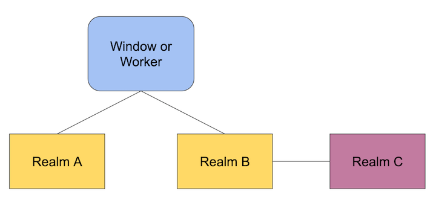
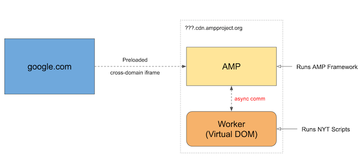

# ShadowRealms Explainer

<!-- vscode-markdown-toc -->
* [Introduction](#Introduction)
* [API (TypeScript Format)](#APITypeScriptFormat)
* [Motivations](#Motivations)
* [Clarifications](#Clarifications)
* [Why not separate processes?](#Whynotseparateprocesses)
* [Security](#Security)
* [Use Cases](#UseCases)
  * [Third Party Scripts](#ThirdPartyScripts)
  * [Code Testing](#CodeTesting)
    * [Running tests in a ShadowRealm](#RunningtestsinaRealm)
    * [Test FWs + Tooling to run tests in a shadowRealm](#TestFWsToolingtoruntestsinarealm)
  * [Codebase segmentation](#Codebasesegmentation)
  * [Template libraries](#Templatelibraries)
  * [DOM Virtualization](#DOMVirtualization)
    * [DOM Virtualization: AMP WorkerDOM Challenge](#DOMVirtualization:AMPWorkerDOMChallenge)
    * [JSDOM + vm Modules](#JSDOMvmModules)
  * [Virtualized Environment](#VirtualizedEnvironment)
    * [DOM mocking](#DOMmocking)
* [Modules](#Modules)
* [Integrity](#Integrity)
* [Status Quo](#StatusQuo)
* [Iframes](#Iframes)
* [FAQ](#FAQ)

<!-- vscode-markdown-toc-config
	numbering=false
	autoSave=true
	/vscode-markdown-toc-config -->
<!-- /vscode-markdown-toc -->

## <a name='Introduction'></a>Introduction

The ShadowRealm proposal provides a new mechanism to execute JavaScript code within the context of a new global object and set of JavaScript built-ins.

The API enables control over the execution of different programs within a Realm, providing a proper mechanism for virtualization. This is not possible in the Web Platform today and the proposed API is aimed to a seamless solution for all JS environments.

There are various examples where the ShadowRealm API can be well applied to:

  * Web-based IDEs or any kind of 3rd party code execution using same origin evaluation policies.
  * DOM Virtualization (e.g.: Google AMP)
  * Test frameworks and reporters (in-browser tests, but also in node using `vm`).
  * testing/mocking (e.g.: jsdom)
  * Server side rendering (to avoid collision and data leakage)
  * in-browser code editors
  * in-browser transpilation

This document expands a list of some of these [use cases with examples](#UseCases).

As detailed in the [Security](#Security) section, the ShadowRealm API is not a full spectrum mechanism against security issues when evaluating code. As such, it makes it a bad choice for some code execution use cases (e.g., spreadsheet functions blocking the main UI thread).

## <a name='APITypeScriptFormat'></a>API (TypeScript Format)

This is the ShadowRealm API description in TypeScript format:

```ts
declare class ShadowRealm {
    constructor();
    importValue(specifier: string, bindingName: string): Promise<PrimitiveValueOrCallable>;
    evaluate(sourceText: string): PrimitiveValueOrCallable;
}
```

The proposed specification defines:

- The [`constructor`](https://tc39.es/proposal-shadowrealm/#sec-shadowrealm).
- The [`ShadowRealm#importValue()`](https://tc39.es/proposal-shadowrealm/#sec-shadowrealm.prototype.importvalue) method, equivalent to the `import()` expression, but capturing a primitive or callable values.
- The [`get ShadowRealm#evaluate`](https://tc39.es/proposal-shadowrealm/#sec-shadowrealm.prototype.evaluate) method promotes an indirect eval in the shadowRealm but only allows the return of primitive or callable values.
- A new wrapped function exotic object with a custom `[[Call]]` internal that has a shared identity of a connected function from another realm associated to it. This identity is not exposed and there is no way to trace back to connected functions cross-realms in user-land.

### <a name='QuickAPIUsageExample'></a>Quick API Usage Example

```javascript
const red = new ShadowRealm();

// realms can import modules that will execute within its own environment.
// When the module is resolved, it captured the binding value, or creates a new
// wrapped function that is connected to the callable binding.
const redAdd = await red.importValue('./inside-code.js', 'add');

// redAdd is a wrapped function exotic object that chains its call to the
// respective imported binding.
let result = redAdd(2, 3);

console.assert(result === 5); // yields true

// The evaluate method can provide quick code evaluation within the constructed
// shadowRealm without requiring any module loading, while it still requires CSP
// relaxing.
globalThis.someValue = 1;
red.evaluate('globalThis.someValue = 2'); // Affects only the ShadowRealm's global
console.assert(globalThis.someValue === 1);

// The wrapped functions can also wrap other functions the other way around.
const setUniqueValue =
    await red.importValue('./inside-code.js', 'setUniqueValue');

/* setUniqueValue = (cb) => (cb(globalThis.someValue) * 2); */

result = setUniqueValue((x) => x ** 3);

console.assert(result === 16); // yields true
```

## <a name='Motivations'></a>Motivations

It's quite common for applications to contain programs from multiple sources, whether from different teams, vendors, package managers, etc., or just programs with different set of requirements from the environment.

These programs must currently contend for the global shared resources, specifically, the shared global object, and the side effect of executing those programs are often hard to observe, causing conflicts between the different programs, and potentially affecting the integrity of the app itself.

Attempting to solve these problems with existing DOM APIs will require implementing an asynchronous communication protocol, which is often a deal-breaker for many use cases. It usually just adds complexity for cases where a same-process Realm is sufficient. It's also very important that values can be immediately shared. Other communications require data to be serialized before it's sent back and forth.

__The primary goal of this proposal is to provide a proper mechanism to control the execution of a program, providing a new global object, a new set of intrinsics, no access to objects cross-realms, a separate module graph and synchronous communication between both realms__.

In addition to the motivations given above, another commonly-cited motivation is virtualization and portability. Some of the functionalities of the VM module in Node can also be standardized, providing the infrastructure for virtualization of JavaScript programs in all environments.

Finally, a distinct but related problem this proposal could solve is the current inability to completely virtualize the environment where the program should be executed. With this proposal, we are taking a giant step toward that missing feature of the language.

A ShadowRealm-like API is an often-requested feature from developers, directly or indirectly. It was an original part of the ES6 spec, but it didn't make to the initial cut. This proposal attempts to resolve prior objections and get to a solution that all implementers can agree upon.

## <a name='Nongoals'></a>Non-goals

This proposal does not aim to provide host hooks, or any other mechanism to control or prevent IO operations from within the ShadowRealm instance.

The ShadowRealm proposal does not aim to provide availability protection as it is designed to share the same thread to allow synchronous communication between Realms.

It does not provide full protection for confidentiality, as such, a ShadowRealm instance initially provides access to APIs that can be used to infer information and sense the timing from the environment in various ways.

### <a name='Operation'></a>How does a ShadowRealm operate?

A ShadowRealm executes code with the same JavaScript heap as the surrounding context where the ShadowRealm instance is created. Code runs synchronously in the same thread. Note: The surrounding context is often referenced as the _incubator realm_ within this proposal.

Same-origin iframes also create a new global object which is synchronously accessible. A ShadowRealm differs from same-origin iframes by omitting Web APIs such as the DOM, and async config for code injected through dynamic imports. Problems related to identity discontinuity exist in iframes but are not a possibility in a ShadowRealm as object values are not transferred cross-realms in user land. The only connection exists internally through wrapped functions.

Sites like Salesforce.com make extensive use of same-origin iframes to create such global objects. Our experience with same-origin iframes motivated us to steer this proposal forward, which has the following advantages:

- Frameworks would be able to better craft the available API within the global object of the ShadowRealm, aiming for what is necessary to evaluate the program.
- Tailoring up [the exposed set of APIs into the code](#VirtualizedEnvironment) within the ShadowRealm provides a better developer experience for a less expensive work compared to tailoring down a full set of exposed APIs - e.g. iframes - that includes handling presence of `[LegacyUnforgeable]` attributes like `window.top`.
- We hope the resources used for a ShadowRealm will be somewhat lighter weight (both in terms of memory and CPU) for the browser when compared to an iframe, especially when frameworks rely on several Realms in the same application.
- A ShadowRealm is not accessible by traversing the DOM of the incubator realm. This will be an ideal and/or better approach compared to attaching iframes elements and their contentWindow to the DOM. [Detaching iframes](#Iframes) would also add new set of problems.
- A newly created shadowRealm does not have immediate access to any object from the incubator realm - and vice-versa - and won't have access to `window.top` as iframes would.

The ShadowRealm API is complementary to stronger isolation APIs such as Workers and cross-origin iframes. The API is useful for contexts where synchronous execution is an essential requirement, e.g., emulating the DOM for integration with third-party code. A ShadowRealm instance can avoid often-prohibitive serialization overhead by using a common heap as the surrounding context.

The ShadowRealm API does __not__ introduce a new evaluation mechanism. The code evaluation is subject to the [same restrictions of the incubator realm via CSP](#Evaluation), or any other restriction in Node.

JavaScript modules are associated with a global object and set of built-ins. Each ShadowRealm instance contains its own separate module graph which runs in the context of that ShadowRealm, so that a full JavaScript development experience is available.

## <a name='Clarifications'></a>Clarifications

### <a name='Terminology'></a>Terminology

In the Web Platform, both `Realm` and `Global Object` are usually associated to Window, Worker, and Worklets semantics. They are also associated to their detachable nature, where they can be pulled out from their parent DOM tree.

This proposal is limited to the semantics specified by ECMA-262 with no extra requirements from the web counterparts.

### <a name='TheRealmsGlobalObject'></a>The ShadowRealm's Global Object

Each ShadowRealm's [Global Object](https://tc39.es/ecma262/#sec-ordinary-object) is an [Ordinary Object](https://tc39.es/ecma262/#sec-ordinary-object). It does not require exotic internals or new primitives.

Instances of ShadowRealm Objects and their Global Objects have their lifeline to their incubator Realm, they are not _detachable_ from it. Instead, they work as a group, sharing the settings of their incubator Realm. In other words, they act as encapsulation boundaries, they are analogous to a closure or a private field.



### <a name='Evaluation'></a>Evaluation

Any code evaluation mechanism in this API is subject to the existing [Content-Security-Policy (CSP)](https://developer.mozilla.org/en-US/docs/Web/HTTP/Headers/Content-Security-Policy).

If the CSP directive from a page disallows `unsafe-eval`, it prevents synchronous evaluation in the ShadowRealm, i.e.: `ShadowRealm#evaluate`.

The CSP of a page can also set directives like the `default-src` to prevent a ShadowRealm from using `ShadowRealm#importValue()`.

### <a name='ModuleGraph'></a>Module Graph

Each instance of a ShadowRealm must have its own Module Graph.

```javascript
const shadowRealm = new ShadowRealm();

// imports code that executes within its own environment.
const doSomething = await shadowRealm.importValue('./file.js', 'redDoSomething');

// This call chains to the shadowRealm's redDoSomething
doSomething();
```

### <a name='Compartments'></a>Compartments

This proposal does not define any virtualization mechanism for host behavior. Therefore, it distinguishes itself from the current existing [Compartments](https://github.com/tc39/proposal-compartments) proposal.

A new [Compartment](https://github.com/tc39/proposal-compartments) provides a new Realm constructor. A Realm object from a Compartment is subject to the Compartment's host virtualization mechanism.

```javascript
const compartment = new Compartment(options);
const VirtualizedRealm = compartment.globalThis.ShadowRealm;
const shadowRealm = new VirtualizedRealm();
const doSomething = await shadowRealm.importValue('./file.js', 'redDoSomething');
```

The Compartments proposal offers a more complex API that offers tailoring over aspects beyond the global APIs but with modifications to internal structure such as module graph. The ShadowRealm API just offers immediate access to what is already specified in ECMAScript as it's already structured to distinguish different references from realms.

### <a name='Whynotseparateprocesses'></a>Why not separate processes?

Creating a Realm that runs in a separate process is another alternative, while allowing users to define and create their own protocol of communication between these processes.

This alternative was discarded for two main reasons:

1. There are existing mechanism to achieve this today in both browsers, and nodejs. E.g.: cross-origin iframes, workers, etc. They seem to be good enough when asynchronous communication is sufficient to implement the feature.
2. Asynchronous communication is a deal-breaker for many use-cases, specifically when security is __not__ an issue, and sometimes it just added complexity for cases where a same-process Realm is sufficient.

E.g. Google AMP run in a cross-origin iframe, and just want more control about what code they executed in that cross-origin application.

There are some identified challenges explained within the current use cases for a ShadowRealm such as the [WorkerDOM Virtualization challenge for Google AMP](#DOMVirtualization) and the current use of [JSDOM and Node VM modules](#JSDOMvmModules) that would be better placed using an interoperable ShadowRealm API as presented by this proposal.

## <a name='Security'></a>Security

It is useful to look at this from the lenses of [the taxonomy of security essay](https://agoric.com/blog/all/taxonomy-of-security-issues/), which formalizes a framework to explain security and modularity issues in various systems.

Based on the essay linked above, we can say that the ShadowRealm proposal provides a very limited protection:

> ✅ integrity ⛔️ availability ⚠️ confidentiality

### ✅ <a name='Integrity'></a>Integrity

This proposal can be a good complement to integrity mechanisms by providing ways to evaluate code across different object graphs (different global objects) while maintaining the integrity of both realms. The integrity guarantee of the ShadowRealm API only extends to code that might inadvertently step on each other's feet (e.g. writing to the same global variable).

A concrete example of this is the Google's AMP current mechanism:

* Google News App creates multiples sub-apps that can be presented to the user.
* Each sub-app runs in a cross-origin iframe (communicating with the main app via post-message).
* Each vendor (one per app) can attempt to enhance their sub-app that display their content by executing their code in a ShadowRealm that provide access to a well defined set of APIs to preserve the integrity of the sub-app.

### ⛔️ <a name='Availability'></a>Availability Protection

A ShadowRealm shares the same process with its incubator Realm. While direct cross-realm object access is prevented via the callable boundary, the ShadowRealm API was design to share a heap and thus a process. This is what allows the synchronous communication between the incubator realm and the ShadowRealm instance. This means all those resources are shared, preventing the ShadowRealm or the incubator realm from providing any guarantees in terms of liveness or progress. In other words, code running in a ShadowRealm can produce resource exhaustion, or excessive allocation of memory that can prevent the incubator realm from proceeding.

A concrete example of this is plugin system to implement heavy matrix computations:

* Each plugin can receive that, and carry on computation task.
* The task to compute can be implemented in an asynchronous manner due to the nature of the computation.
* The main UI thread will remain block during the heavy computation even though the result is expected to be produced asynchronously.


### ⚠️ <a name='Confidentiality'></a>Confidentiality Protection

Confidentiality, also known as Information Hiding or Secrecy, cannot be fully guaranteed by the ShadowRealm API. On the Web, two good examples of confidentiality violations are fingerprinting, and privacy violations.

To provide Confidentiality, no one can infer information they are not supposed to know. The most pernicious threats to confidentiality are side channels like Meltdown and [Spectre](https://leaky.page/), where code running inside a ShadowRealm can infer another realm’s secrets from timing differences. The APIs available in a ShadowRealm may also be used to infer information about the environment of the user, which is commonly known as fingerprinting.

The ShadowRealm API can however be used as a building block towards providing confidentiality protections, for example when combined with inescapable mechanisms that prevent the measurement of duration, and remove fingerprinting surfaces.

## <a name='UseCases'></a>Use Cases

These are some of the key use cases where The ShadowRealm API becomes very useful and important:

- Third Party Scripts
- Code Testing
- Codebase segmentation
- Template libraries
- DOM Virtualization

### <a name='ThirdPartyScripts'></a>Third Party Scripts

We acknowledge that applications need a quick and simple execution of code. There are cases where **many** scripts are executed for the same application. There isn't a need for a new host or agent. This is also not aiming to defend against malicious code or xss injections. Our focus is on multi-libraries and building blocks from different authors that can conflict with each other.

The ShadowRealm API provides integrity preserving semantics - including built-ins - of root and incubator Realms, setting specific boundaries for the Environment Records.

Third Party Scripts can be executed in a non-blocking asynchronous evaluation through the `ShadowRealm#importValue()`.

There is no need for immediate access to the application globals - e.g. `window`, `document`. This comes as a convenience for the application that can provide - or not - values and API in different ways. This also creates several opportunities for customization with the ShadowRealm Globals and prevent collision with other global values and other third party scripts.

```javascript
const shadowRealm = new ShadowRealm();

// pluginFramework and pluginScript become available in the ShadowRealm
const [ init, ready ] = await Promise.all([
    shadowRealm.importValue('./pluginFramework.js', 'init'),
    shadowRealm.importValue('./pluginScript.js', 'ready'),
]);

// The Plugin Script will execute within the ShadowRealm
init(ready);
```

### <a name='CodeTesting'></a>Code Testing

While multi-threading is useful for testing, the layering enabled from the ShadowRealm API is also great. Test frameworks can use a ShadowRealm to inject code and also control the order of the injections if necessary.

Testing code can run autonomously within the boundaries set from the ShadowRealm object without immediately conflicting with other tests.

#### <a name='RunningtestsinaRealm'></a>Running tests in a ShadowRealm

```javascript
import { test } from 'testFramework';
const shadowRealm = new ShadowRealm();

const [ runTests, getReportString, suite ] = await Promise.all([
    shadowRealm.importValue('testFramework', 'runTests'),
    shadowRealm.importValue('testFramework', 'getReportString'),
    shadowRealm.importValue('./my-tests.js', 'suite'),
]);

// start tests execution
runTests(suite);

// request a tap formatted string of the test results when they are ready
getReportString('tap', res => console.log(res));
```

### <a name='Codebasesegmentation'></a>Codebase segmentation

A big codebase tend to evolve slowly and soon becomes legacy code. Old code vs new code is a constant struggle for developers.

Modifying code to resolve a conflict (e.g.: global variables) is non-trivial, specially in big codebases.

The ShadowRealm API can provide a _lightweight_ mechanism to preserve the integrity of the intrinsics. Therefore, it could isolate libraries or logical pieces of the codebase per ShadowRealm.

### <a name='DOMVirtualization'></a>DOM Virtualization

We still want things to interact with the DOM without spending any excessive amount of resources.

It is important for applications to emulate the DOM as best as possible. Requiring authors to change their code to run in our virtualized environment is difficult. Specially if they are using third party libraries.

```javascript
const shadowRealm = new ShadowRealm();

const initVirtualDocument = await shadowRealm.importValue('virtual-document', 'init');
await shadowRealm.importValue('./publisher-amin.js', 'symbolId');

init();
```

#### <a name='DOMVirtualization:AMPWorkerDOMChallenge'></a>DOM Virtualization: AMP WorkerDOM Challenge

Problem: `Element.getBoundingClientRect()` doesn't work over async comm channels (i.e. [worker-dom](https://github.com/ampproject/worker-dom)).



The communication is also limited by serialization aspects of [transferable objects](https://html.spec.whatwg.org/multipage/structured-data.html#transferable-objects), e.g.: functions or Proxy objects are not _transferable_.

#### <a name='JSDOMvmModules'></a>JSDOM + vm Modules

JSDOM [relies on VM](https://github.com/jsdom/jsdom/blob/0b1f84f499a0b23fad054228b34412869f940765/lib/jsdom/living/nodes/HTMLScriptElement-impl.js#L221-L248) functionality to emulate the __HTMLScriptElement__ and maintains a [shim of the vm module](https://github.com/jsdom/jsdom/blob/bfe7de63d6b1841053d572a915b2ff06bd4357b9/lib/jsdom/vm-shim.js) when it is bundled to run in a webpage where it doesn’t have access to the Node's __vm__ module.

The ShadowRealm API provides a single API for this virtualization in both browsers and NodeJS.

### <a name='VirtualizedEnvironment'></a>Virtualized Environment

The usage of different realms allow customized access to the global environment. To start, The global object could be immediately frozen.

```javascript
const shadowRealm = new ShadowRealm();

shadowRealm.evaluate('Object.freeze(globalThis), 0');

// or without CSP relaxing:

const freezeRealmGlobal = await shadowRealm.importValue('./inside-code.js', 'reflectFreezeRealmGlobal');

/**
 * inside-code.js
 * 
 * export function reflectFreezeRealmGlobal() {
 *   try {
 *     Object.freeze(globalThis);
 *   catch {
 *     return false;
 *   }
 *   return true;
 * }
 **/

freezeRealmGlobal();
```

In web browsers, this is currently not possible. The way to get manage new ShadowRealms would be through iframes, but they also share a window proxy object.

```javascript
const iframe = document.createElement('iframe');
document.body.appendChild(iframe);
const rGlobal = iframe.contentWindow; // same as iframe.contentWindow.globalThis

Object.freeze(rGlobal); // TypeError, cannot freeze window proxy
```

The same iframe approach won't also have a direct access to import modules dynamically. The usage of `shadowRealm.importValue` is possible instead of roughly using eval functions or setting _script type module_ in the iframe, if available.

#### <a name='DOMmocking'></a>DOM mocking

The ShadowRealm API allows a much smarter approach for DOM mocking, where the globalThis can be setup in userland:

```javascript
const shadowRealm = new ShadowRealm();

const installFakeDOM = await shadowRealm.importValue('./fakedom.js', 'default');

// Custom properties can be added to the ShadowRealm
installFakeDOM();
```

This code allows a customized set of properties to each new ShadowRealm - e.g. `document` - and avoid issues on handling immutable accessors/properties from the Window proxy. e.g.: `window.top`, `window.location`, etc..

This explainer document speculates a `installFakeDOM` API to set up a proper frame emulation. We understand there might be many ways to explore how to emulate frames with plenty of room for improvement, as seen in [some previous discussions](https://github.com/tc39/proposal-shadowrealm/issues/268#issuecomment-674338593), as in the following pseudo-code:

```javascript
export default function() {
  const someRealmIntrinsicsNeededForWrappers = extractIntrinsicsFromGlobal(customGlobalThis);
  Object.defineProperties(globalThis, {
    document: createFakeDocumentDescriptor(someRealmIntrinsicsNeededForWrappers),
    Element: createFakeElementDescriptor(someRealmIntrinsicsNeededForWrappers),
    Node: ...
    ... // all necessary DOM related globals should be defined here
  });
}

function createFakeDocumentDescriptor(someIntrinsics) {
     return {
          enumerable: true,
          configurable: false,
          get: new someIntrinsics.Proxy(document, createHandlerWithDistortionsForDocument(someIntrinsics));
     };
}

function extractIntrinsicsFromGlobal(customGlobalThis) {
   return {
       Proxy,
       ObjectPrototype: Object.prototype,
       create: Object.create,
       ... // whatever you need to facilitate the creation of proper identities for the fake DOM
   };
}
```

## <a name='Errors'></a>Errors

Errors originated from a ShadowRealm are subject to stack censoring. Similarly, those errors must be copied when crossing the callable boundary, while doing so, the host must produce a TypeError, and may provide a message and stack properties without violating the stack censoring principle. For more details about errors, refer to the [errors explainer](./errors.md).

## <a name='Modules'></a>Modules

In principle, the ShadowRealm proposal does not provide the controls for the module graphs. Every new ShadowRealm initializes its own module graph, while any invocation to `ShadowRealm.prototype.importValue()` method, or by using `import()` when evaluating code inside the shadowRealm through wrapped functions, will populate this module graph. This is analogous to same-domain iframes, and VM in nodejs.

However, the [Compartments](https://github.com/tc39/proposal-compartments) proposal plans to provide the low level hooks to control the module graph per ShadowRealm. This is one of the intersection semantics between the two proposals.


### <a name='Example:VirtualizedContexts'></a>Example: Virtualized Contexts

Importing modules allow us to run asynchronous executions with set boundaries for access to global environment contexts.

- `main.js`:

```javascript
globalThis.blueValue = "a global value";

const r = new ShadowRealm();

r.importValue("./sandbox.js", "test").then(test => {

  // globals in the incubator shadowRealm are not leaked to the constructed shadowRealm
  test("blueValue"); // undefined
  test("redValue"); // 42
});
```

- `sandbox.js`:

```javascript
// blueValue is not available as a global name here

// Names here are not leaked to the incubator shadowRealm
globalThis.redValue = 42;

export function test(property) {
  return globalThis[property];
}
```

## <a name='Example:iframesvsRealms'></a>Example: iframe vs ShadowRealm

If you're using anonymous iframe today to "evaluate" javascript code in a different realm, you can replace it with a new ShadowRealm, as a more performant option, without identity discontinuity, e.g.:

```javascript
const globalOne = window;
let iframe = document.createElement('iframe');
document.body.appendChild(iframe);
const iframeArray = iframe.contentWindow.Array;

console.assert(iframeArray !== Array);

const list = iframeArray('a', 'b', 'c');

list instanceof Array; // false
[] instanceof iframeArray; // false
Array.isArray(list); // true
```

This code is **not** possible with the ShadowRealm API! Non-primitive values are not transfered cross-realms using the ShadowRealm API.

## <a name='Example:NodesvmobjectsvsRealms'></a>Example: Node's vm objects vs ShadowRealms

If you're using node's `vm` module today to "evaluate" javascript code in a different realm, you can replace some of its usage with a new ShadowRealm, e.g.:

```javascript
const vm = require('vm');
const script = new vm.Script(`
function add(a, b) {
  return a + b;
}

const x = add(1, 2);
`);
script.runInContext(new vm.createContext());
```

will become:

```javascript
const shadowRealm = new ShadowRealm();

const result = shadowRealm.evaluate(`
function add(a, b) {
  return a + b;
}

const x = add(1, 2);
x;
`);
```

__Note__: these two are rough equivalents in functionality only. The `vm` API still has some extended capabilities and ergonomics, even if it fundamentally allow code execution in a different realm.

## <a name='StatusQuo'></a>Status Quo

The current status quo is using VM module in nodejs, and same-domain iframes in browsers. Although, VM modules in node is a very good approximation to this proposal, iframes are problematic.

## <a name='Iframes'></a>Iframes

Developers can technically already create a new ShadowRealm by creating a new same-domain iframe, but there are a few impediments to using this as a reliable mechanism:

* the global object of the iframe is a window proxy, which implements a bizarre behavior, including its unforgeable proto chain.
* There are multiple ~~unforgeable~~ unvirtualizable objects due to the DOM semantics, this makes it almost impossible to eliminate certain capabilities while downgrading the window to a brand new global without DOM.
* The global `top` reference cannot be redefined and leaks a reference to another global object. The only way to null out this behavior is to __detach__ the iframe, which imposes other problems, the more relevant being a restriction to dynamic `import()` calls.
* Exposure of cross-realms objects with identity discontinuity.

### <a name='Detachable'></a>Detachable

For clarifications, the term detachable means an iframe pulled out from the DOM tree:

```javascript
var iframe = document.createElement("iframe");

 // attaching the iframe to the DOM tree
document.body.appendChild(iframe);

var iframeWindow = iframe.contentWindow;

// Get accessor that returns the topmost window.
iframeWindow.top; // Cannot be properly redefined/virtualized: { get: top(), set: undefined, enumerable: true, configurable: false }

// **detaching** the iframe
document.body.removeChild(iframe);

// get accessor still exists, now returns null
iframeWindow.top;
```

## <a name='FAQ'></a>FAQ

### So does the ShadowRealm API only have the ECMAScript APIs available?

It creates a new copy of the built-ins from ECMAScript. Additionally, the host can add other APIs. We have open discussions about additional [HTML properties](https://github.com/tc39/proposal-shadowrealm/issues/284) or [some intrinsics subset](https://github.com/tc39/proposal-shadowrealm/issues/288).

### Can I use the ShadowRealm API to run code securely?

It depends on what kind of security protections are required. See the [Security](#Security) section for details.

### Most libraries won't work unless they add dependencies manually

> Doesn't this mean that most libraries won't work unless to add its dependencies manually. Like we could see people using this even to isolate WebAssembly code, thought that requires you adding the methods needed for that.

Absolutely, this is equivalent to what happens to [Node VM](https://nodejs.org/api/vm.html) today as a low level API prior art. As a developer you need to setup the environment to execute code.

Ideally the ShadowRealms would arrive a clean state, allowing tailoring for what is necessary to be added. This contrasts with the tailoring over unforgeables. e.g. `window.top`, `window.location`, etc

Considering all the trade offs, the clean state seems the best option, in our opinion. It allows tailoring for multiple purposes and comprehends more use cases.

### Exploration ahead

There is more to explore ahead for the ShadowRealm proposal, but not yet for this current proposal. The current API is good enough to enable synchronous execution of code and membranes implementation, even if setup might require async import for code injection.
